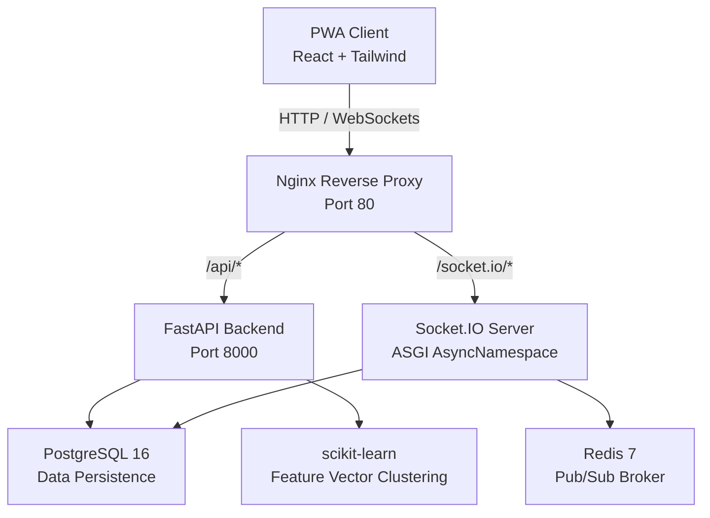
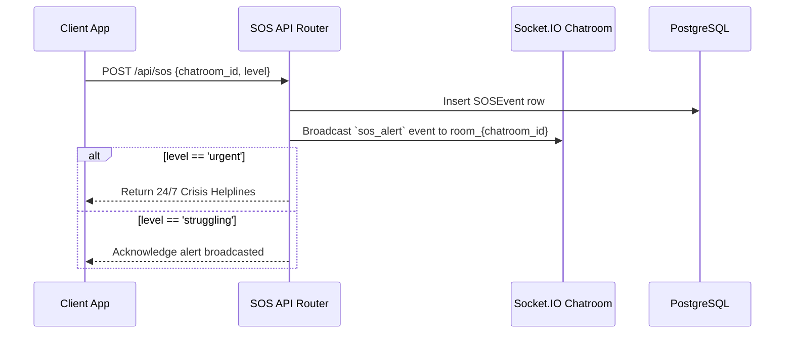

# MAD — System Architecture & Anonymity Specification

## 1. Overview

MAD (Anonymous Addiction Support App) is built with strict anonymity boundaries at the database layer. No endpoint or query ever joins PII fields from `users` or `questionnaire_responses` into chatroom or message data returned to clients.

## 2. Core Components

## 3. Data Isolation Matrix

| Layer | Table | Exposed to Chat API? | Allowed Fields |
|---|---|---|---|
| PII | `users` | ❌ No | `email_hash` (SHA-256), `password_hash` (bcrypt) |
| PII | `questionnaire_responses` | ❌ No | `addiction_type`, `frequency`, `feature_vector` |
| Anonymous | `profiles` | ✅ Yes | `display_name` (e.g. "Fox_482"), `avatar_seed` |
| Anonymous | `chatrooms` | ✅ Yes | `id`, `addiction_type`, `is_general` |
| Anonymous | `messages` | ✅ Yes | `content`, `sent_at`, `profile_id` |

## 4. Algorithmic Matching Vector Specification

The feature vector encodes user questionnaire responses into a 7-dimensional space:
- `v[0..2]`: One-hot encoded addiction type (`alcohol`, `smoking`, `gaming`)
- `v[3]`: Normalized frequency score (`daily`: 1.0, `weekly`: 0.7, `monthly`: 0.4, `rarely`: 0.1)
- `v[4]`: Severity score (derived from onset & frequency)
- `v[5]`: Disclosed to others binary (0.0 or 1.0)
- `v[6]`: Knows similar others binary (0.0 or 1.0)

Vectors are L2-normalized using `sklearn.preprocessing.normalize` prior to running K-Means clustering.

## 5. SOS Crisis Alert Path

